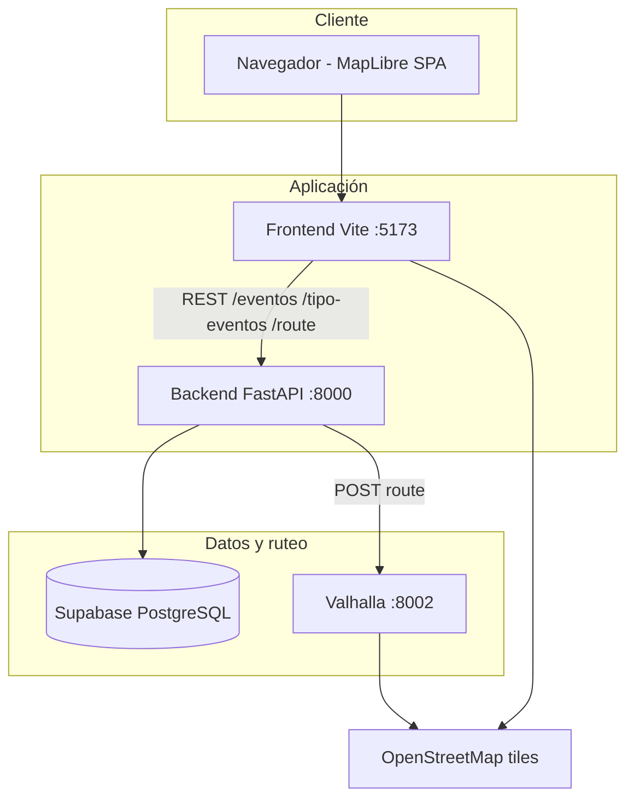

# Arquitectura de servicios

Ligthwatch distribuye responsabilidades entre cuatro piezas que se comunican por red en Docker o en desarrollo local.

## Rol de cada componente

| Servicio | Responsabilidad |
|----------|-----------------|
| **Frontend** | UI del mapa, modos, llamadas REST, dibujo de marcadores y polilíneas |
| **Backend** | API REST, validación Pydantic, proxy a Valhalla, CRUD en Supabase |
| **Supabase** | Persistencia de `TipoEventos` y `eventos` |
| **Valhalla** | Motor de ruteo sobre grafo OSM; recibe `exclude_polygons` |

## Flujo de carga inicial

1. El usuario abre el frontend.
2. Al evento `map.load`, el cliente llama `GET /eventos`.
3. Cada registro válido se renderiza como marcador + círculo de influencia.

## Flujo de registro de evento

1. Usuario coloca punto y elige tipo.
2. `POST /eventos` con `tipo_evento`, `latitud`, `longitud`, `activo`.
3. Backend inserta en Supabase y devuelve el registro creado.
4. Frontend añade marcador sin recargar toda la página.

## Flujo de cálculo de ruta

1. Usuario define dos `locations` (lon/lat).
2. Frontend obtiene eventos negativos y construye polígonos circulares.
3. `POST /route` al backend con `costing: pedestrian`, `shortest: true` y opcionalmente `exclude_polygons`.
4. Backend reenvía a Valhalla y devuelve la polilínea codificada.
5. Frontend decodifica y dibuja la capa `route`.

:::info Documentación técnica ampliada
Endpoints, esquema SQL y variables de entorno: [backend/main.md](../backend/main.md), [datos/supabase.md](../datos/supabase.md), [setup/env.md](../setup/env.md).
:::

## Por qué Docker Compose

El `docker-compose.yml` alinea versiones y nombres de host internos (`valhalla`, `backend`) para que el backend resuelva `http://valhalla:8002` sin configuración extra en el contenedor.
