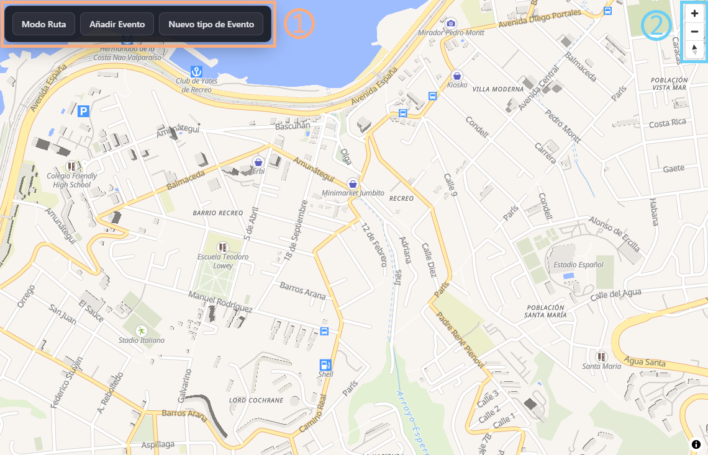
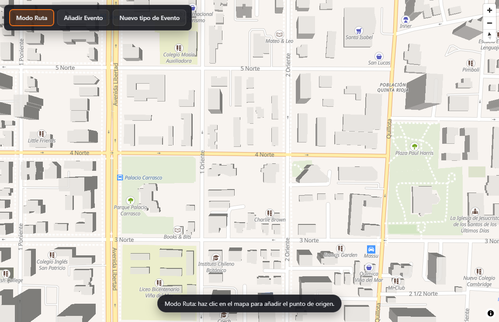
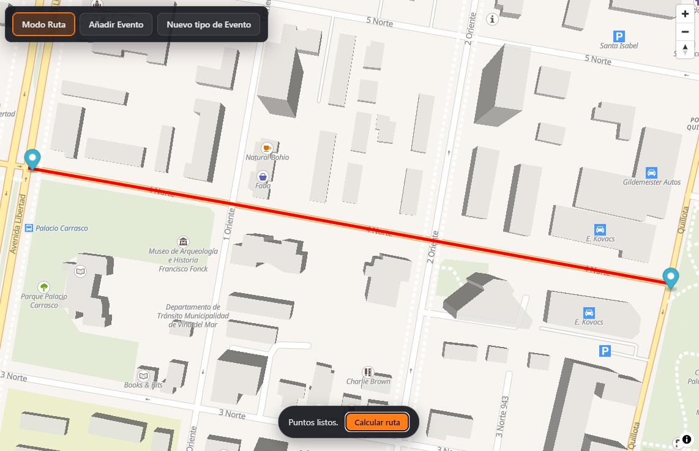
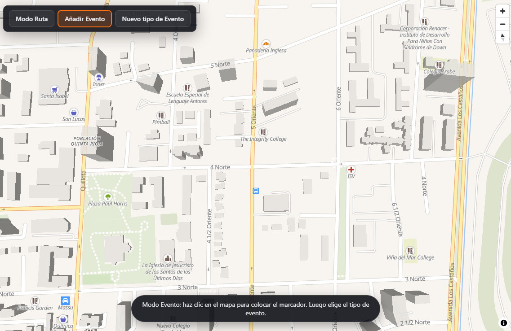
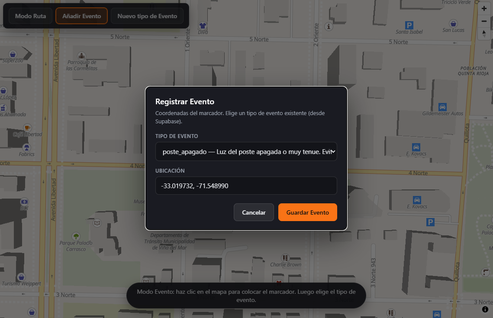
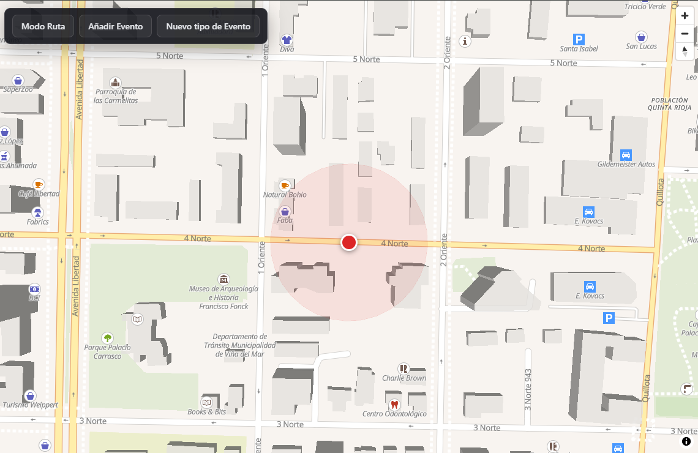
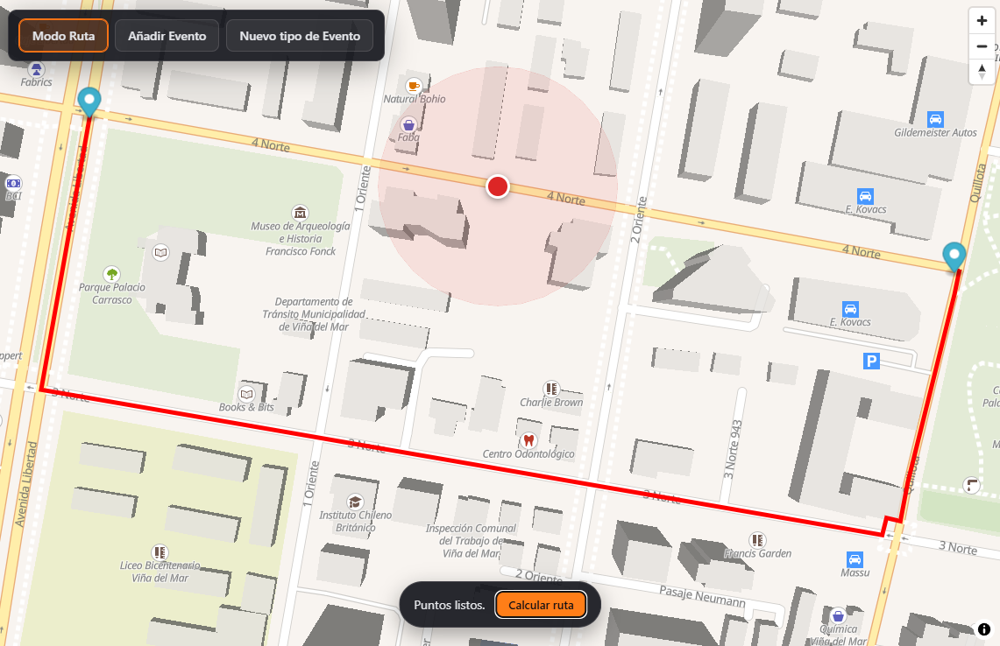
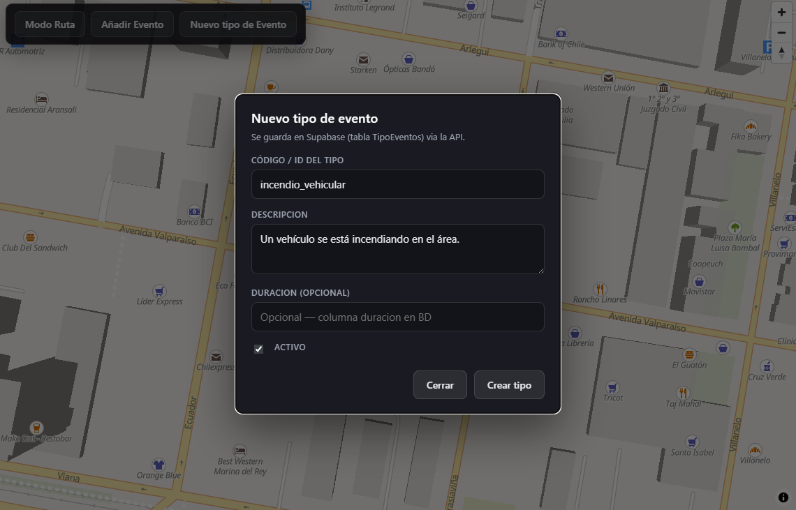

# Manual de Usuario — Ligthwatch

## 1. Controles de Usuario

El usuario dispone de los siguientes controles en la interfaz principal:

- **Marcados con `1`**: Modo Ruta, Añadir Evento, Añadir Nuevo Tipo de Evento.
- **Marcados con `2`**: Controles de navegación del mapa (zoom, desplazamiento, etc.).

---

## 2. Modo Ruta

Al activar el modo ruta, el usuario puede hacer clic en dos puntos del mapa para definir un origen y un destino.

---

## 3. Cálculo de Ruta sin Obstáculo

Una vez seleccionados los dos puntos, el usuario presiona **Calcular Ruta** para visualizar la ruta entre ellos.

---

## 4. Añadir Evento

El usuario puede hacer clic en cualquier parte del mapa para indicar dónde desea registrar un evento.

---

## 5. Registro de Evento

Después de seleccionar la ubicación, el usuario elige el tipo de evento desde una lista desplegable.

---

## 6. Evento Registrado

Una vez registrado, el evento se visualiza en el mapa como un punto rojo con un área semitransparente alrededor.

---

## 7. Cálculo de Ruta con Obstáculo (Ruta Segura)

El usuario puede volver a calcular una ruta, y esta vez el algoritmo considera los eventos registrados y los evita, generando una ruta segura.

---

## 8. Crear Nuevo Tipo de Evento

El usuario puede crear nuevos tipos de evento. En el ejemplo de la imagen se agrega un tipo de evento *Vehículo Incendiado*.

